# vLLM × Dynamo CPU Tier Integration: Diagnosis, Fix, and Quantification

---

## TL;DR (Executive Summary)

**Problem.** vLLM's native CPU offload (`OffloadingConnector`) emits KV-cache events that Dynamo's KV router silently drops or misclassifies. As a result, Dynamo cannot see what each worker has in its CPU tier, makes blind routing decisions, and wastes prefill compute on prefixes that *are* cached — they're just on a worker but the router doesn't know.

**Root cause** is in three layers (full diagnosis in §2):
1. **[Easy]** Medium-name mismatch (`"CPU"` vs `"CPU_PINNED"`) → events fall into the Device tier as default
2. **[Complex]** Connector emits BlockStored events without `token_ids` / `block_size` / `parent_block_hash` → Dynamo cannot rebuild its radix tree → silent drop
3. **[Next phase]** When vLLM's *group offload* mode is enabled (`block_size_factor > 1`), a single offload event covers multiple GPU blocks under a single hash → Dynamo cannot align its block-level index. Disabled by default in vLLM; **explicitly out of scope for this work**, scheduled as a follow-up.

**Solution.**
* vLLM `e074f0a` — populate full `BlockStored` payload from a side-table in `OffloadingConnectorScheduler`
* Dynamo `6c2a73a` — accept `"CPU"` as an alias for the `HostPinned` tier
* Dynamo `5b7725f` — plumb `kv_cache_events_applied` counters into the lower-tier indexer so the new CPU-tier traffic is observable on Prometheus

**Headline result** at production saturation; **3 cold-start repeats, mean ± std**.

*Hardware:* 8× B200 (single node, 192 GB HBM per GPU), 1 GPU per worker (TP=1), `gpu_memory_utilization=0.5` (≈ 96 GB allocated per engine; after Qwen3-32B bf16 weights + activations, **≈ 26 GB usable for device KV per worker** = 100 K tokens, intentionally tight to make the CPU tier matter), `cpu_bytes_to_use = 150 GiB` per worker (600 K tokens of CPU-tier KV per worker).

*Model:* Qwen/Qwen3-32B, BF16, `max_model_len=40960`.

*Workload (`generate_multi_turn_longbench.json`):* multi-turn chat from vLLM's `benchmark_serving_multi_turn.py`, 128 conversations, **`prefix_num_tokens = 15 000` per conversation (constant, hot-warming sample)**, `num_turns ∈ uniform[30, 50]` (~40 mean), per-turn user msg ∈ uniform[60, 80] tokens, generation length ∈ uniform[40, 60] tokens. **Effective ISL grows over turns** (history accumulates): turn 1 ≈ 15.1 K tokens → turn 40 ≈ 19.8 K → turn 50 ≈ 21 K. **OSL ≈ 50** tokens/turn. **No common prefix across conversations** (each conversation has its own 15 K prefix from `pg1184.txt`/`pg2600.txt`/`pg10.txt`), so cache reuse comes purely from sticking each conversation's later turns onto the worker that already prefilled its earlier turns — *not* from a shared system prompt.

*Concurrency:* `num_clients = max_active_conversations = 128`, `request_rate = 0.5 req/s/client`.

| Metric | Baseline (no patches) | **Best (this work)** | Delta |
|---|---|---|---|
| Throughput | 8.89 ± 0.03 req/s | **32.14 ± 0.46 req/s** | **+261 %** |
| TTFT p99 | 13.3 s | **2.7 s** | **−5.0×** |
| TPOT p99 | 142 ms | **30 ms** | **−4.7× (= GPU decode floor)** |
| Wasted prompt-token compute | 71.83 ± 0.17 % | **7.60 ± 0.16 %** | **−64.2 pp** |
| Overall cache hit (token-weighted) | 28 % | **92 %** | **+64 pp** |

The same pattern holds across concurrency 8 → 384 (§6.3, §6.9 ceiling), request rate 0.1 → 4.0 (§6.7), conversation prefix 5 K → 30 K (§6.5), on the LMCache team's own `LMBenchmark` workload (§6.6), and §6.8 pre-warm ablation.

**Recommended settings** based on the (h × pl) sweep in §6.4:

```
host_cache_hit_weight = 1.0   # currently hardcoded 0.75
prefill_load_scale    = 10    # currently hardcoded 1.0; 100 is best but extreme
```

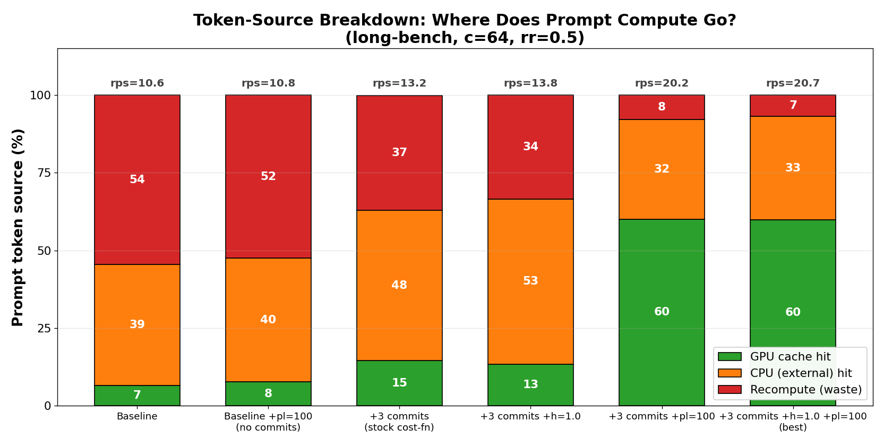

> **Fig 0** — Token-source breakdown across the ablation matrix (long-bench, c=64, rr=0.5). Each bar is the prompt-token budget split into "served by GPU cache" / "served by CPU tier (external)" / "must recompute". The progression baseline → best shrinks the red (waste) band from 54 % to 7 %, while throughput nearly doubles from 10.6 to 20.7 req/s. The second bar (Baseline + pl=100, **no commits**) is the critical control: tuning the cost function *without* the connector patches barely moves the needle (−2 pp). The commits are necessary; the tuning is the multiplier.

---

# Whitepaper

## 1. Background

### 1.1 Why CPU offload matters for Dynamo deployments

For long-context multi-turn workloads (chatbots, agents, code assistants), prefix caching is the single largest determinant of TTFT. A 32B-class model can serve a 20K-token prompt in ~150 ms when the prefix is already in KV cache, vs. ~5 s of prefill from scratch. The arithmetic is brutal at production scale: missing a prefix hit translates to a ~30× TTFT degradation per request.

GPU memory is too small to hold every user's history for a 32B+ model. With `gpu_memory_utilization=0.50` on a B200 (192 GB), roughly 26 GB remains for KV after model weights — about 108 K tokens, or 5–8 conversations worth of cumulative state. Anything beyond that has to live somewhere else.

vLLM's `OffloadingConnector` provides that "somewhere else" — a host-pinned CPU buffer (configured to 150 GiB) that absorbs evictions from the GPU KV pool and serves them back when the prefix is needed again. The mechanics are well-defined inside vLLM.

The gap is at the *cluster* layer. Dynamo's KV-aware router decides which of N workers should serve an incoming request, scoring each worker by how much of the request's prefix is already cached there. That scoring needs accurate per-worker, per-tier state. When the CPU tier is invisible to the router — which we are about to show is the default state today — the router has to assume a worker's prefix is gone the moment GPU evicts it, even though the worker would happily reload from its own CPU buffer.

### 1.2 vLLM's KV event architecture

vLLM emits `BlockStored` and `BlockRemoved` events from two distinct sources:

```
                                     ┌────────────────────────┐
   ┌──── BlockStored / Removed ─────►│   vLLM KVCManager      │
   │      (GPU tier events)          │   BlockPool            │
   │                                 │   cache_full_blocks()  │
   │                                 └────────────────────────┘
   │                                              │
   │   ┌────────────────────────┐                 │
   │   │ vLLM Connector         │                 │
   ├───│ (CPU / disk / external)│◄────────────────┘
   │   │ OffloadingConnector    │   GPU → CPU eviction
   │   │ take_events()          │
   │   └────────────────────────┘
   │
   ▼
ZMQ topic kv-events ──► Dynamo Frontend ──► KvRouter LowerTierIndexer / Device indexer
```

GPU-tier events from `KVCManager.BlockPool.cache_full_blocks()` carry the **complete** payload — `block_hashes`, `parent_block_hash`, `token_ids`, `block_size`, `medium`, `lora_name` — exactly because they originate where the request and its tokenizer context are still in scope. The Dynamo router can recompute its own xxh3-based `LocalBlockHash` and rebuild the prefix radix tree from these events alone.

Connector-tier events follow a different path. The `OffloadingConnectorScheduler` in vLLM was designed as a *block-level* manager (cache policy, hotness, free list) where the natural primary key is a block hash. By the time `take_events()` runs, the originating request and the per-block token context are gone — so the placeholder events are emitted with empty `token_ids`, `block_size = 0`, and `parent_block_hash = None`. That's correct from vLLM's internal perspective, but it strips out exactly the fields Dynamo needs to index the block.

### 1.3 Event timeline

**`OffloadingConnector` is *write-through*, not write-back.** As soon as a GPU block completes (turns into a full, hashable `KVCacheBlock`), the connector issues an *immediate* asynchronous device → host memcpy and registers the CPU-side copy with its own block manager. The CPU copy is not deferred until GPU pressure — it starts populating in parallel. After the memcpy completes (k steps later), the block is *simultaneously* resident in both tiers, and stays that way until each tier independently decides to evict it.

```
  step:           S          S+1                    S+k                          S+M           S+P
                  │           │                      │                            │             │
  block X state:  written     GPU →                 CPU memcpy done →            GPU evict     CPU evict
                  to GPU      BlockStored emitted    BlockStored emitted          BlockRemoved  BlockRemoved
                              ↓                      ↓                            ↓             ↓
  GPU lifetime:               ●━━━━━━━━━━━━━━━━━━━━━━━━━━━━━━━━━━━━━━━━━━━━━━━━━━━●
  CPU lifetime:                                      ●━━━━━━━━━━━━━━━━━━━━━━━━━━━━━━━━━━━━━━━━━●
                               ← k = memcpy duration →
```

The GPU event fires at step `S+1` (right when the block is sealed). The CPU event fires `k` steps later — `k` is the wall-clock time of the device-to-host memcpy on the offload stream, not a function of pressure or eviction. The two tiers then evict independently: GPU usually first (small budget, hot churn), CPU later (large budget, slower turnover).

---

## 2. Diagnosis

### 2.1 Issue 1 — Medium-name mismatch  *[Easy to fix]*

vLLM's `CPULoadStoreSpec.medium()` returns the bare string `"CPU"`. Mooncake's workers emit `"cpu"`.

Dynamo's `StorageTier::from_kv_medium` (Rust, in `lib/kv-router/src/protocols.rs`) only recognizes `"CPU_PINNED"` and `"CPU_TIER1"`. Unrecognized media fall through to the default branch which routes the event into the *Device* (GPU) tier indexer. Then `block_size=0`, the Device indexer **also** silently drops the event at `lib/kv-router/src/zmq_wire/convert.rs:181` when it tries to rebuild a `LocalBlockHash` and finds nothing to hash.

### 2.2 Issue 2 — Missing payload fields  *[Complex but addressable]*

The events leaving `OffloadingConnectorScheduler.take_events()` look like:

```python
BlockStored(
    block_hashes=[h1, h2, h3],
    parent_block_hash=None,    # missing
    token_ids=[],              # missing
    block_size=0,              # missing
    medium="CPU",
    lora_name=None,
)
```

Dynamo needs these fields for three concrete reasons:

| Field | Why Dynamo needs it |
|---|---|
| `token_ids` + `block_size` | The router indexes by its own `LocalBlockHash` = xxh3(parent_hash ‖ token_ids of this block). Without `token_ids`, the router cannot recompute the hash. Without `block_size`, the slicing in event consumers asserts and the entire event is dropped. |
| `parent_block_hash` | If a request's blocks are spread across multiple events (rare in steady state but common during high-rate eviction), each follow-up event can only be linked into the radix tree via its parent hash. Without it, every later block looks like a fresh root and the prefix tree degenerates. |
| `lora_name` | Multi-tenant deployments hash LoRA name into the block key. If unset on the wire and the deployment uses LoRAs, the router computes a different hash than the worker and the lookup misses. (Single-tenant deployments are unaffected.) |

**Effect.** A `BlockStored` with `block_size=0` is dropped at the indexer layer. The lower-tier index stays permanently empty. The router's cost function then has nothing to credit a worker for, and CPU-tier hits are invisible — both to routing decisions and to dashboards.

### 2.3 Issue 3 — Group / chunk offload  *[Out of scope; next phase]*

vLLM has an optional optimization where the `OffloadingSpec` can use a `block_size_factor > 1` and a `hash_block_size_factor > 1`, batching multiple GPU blocks into one offload "chunk" to reduce I/O count and metadata size. In that mode:

* one offload `BlockStored` event covers `F` GPU blocks (typically F = 2 or 4)
* the event uses the **last** GPU block's hash as its key
* GPU-side events still come at GPU-block granularity

Dynamo's radix tree is at GPU-block granularity. Without expansion logic on the connector side, a single chunk event lands as a single radix node spanning `F × block_size` tokens — and none of the intermediate prefix matches anything else in the tree. *[llm-d also suffers from this.]*

**Status.** Group offloading is **disabled by default** in vLLM today. This work targets the common `factor == 1` path and explicitly preserves the placeholder fallback for `factor > 1`. **This is the next phase of the work**, planned as a follow-up patch on the connector.

---

## 3. Solution

### 3.1 Design space

Two natural places to hold the missing payload:

| | A. Connector side (vLLM) | B. Router side (Dynamo, `MissInfoTable`) |
|---|---|---|
| Where the extra `OrderedDict[OffloadKey → (tokens, block_size, parent, lora)]` lives | inside `OffloadingConnectorScheduler` | inside Dynamo's frontend |
| How it's populated | when `_build_store_jobs()` runs, while request + KV-group context are still in scope | when a GPU `BlockStored` event arrives, before its CPU counterpart |
| How it's consumed | drained inside `take_events()` to emit complete `BlockStored` payloads on the wire | looked up when the CPU `BlockStored` arrives, then merged in-memory |
| Works for other frameworks (SGLang, FlexKV…) | ❌ each framework would need its own connector-side patch | ✅ one router-side table works for everyone |
| Works under group/chunk offload (factor > 1) | ✅ trivial to extend (we own both sides of the boundary) | ❌ Dynamo cannot reconstruct the per-GPU-block parent chain from the chunk-level CPU event alone |
| Works under third-party re-hashing | ✅ we control the hash function on the source side | ❌ if a connector re-hashes (e.g., LMCache, FlexKV mid-pipeline), the GPU and CPU hashes disagree and the lookup misses |
| Works without LoRA in the hash function | ✅ we explicitly carry `lora_name` | ❌ assumes hash(token_ids+lora_name) — true for vLLM, not guaranteed for other engines |
| Survives reordering (CPU `BlockStored` before GPU `BlockRemoved`) | ✅ data lives next to the producer | ⚠️ requires TTL to mitigate the race shown below |
| Memory footprint | small, on the vLLM worker | small, on the Dynamo frontend |

This is the `MissInfoTable` race that approach (B) has to handle:

```
 step:           S         S+1              S+2              S+3              S+M (= S+3)         S+M+1 (= S+4)
                 │          │                │                │                │                   │
 block X:        write GPU  GPU              in-flight        Request A        get_new_blocks(X)   memcpy completes
                            BlockStored(X)   memcpy           finishes,        ↓                   in this step
                            store_job        on transfer      X.ref_cnt → 0    BlockRemoved(X)     ↓
                            scheduled        stream           registered in                       complete_store(X)
                                             ↓                pending_jobs                        CPU BlockStored(X)
                                             ↓                                 
                                             ↓                                 
                                             ↓                                
 GPU lifetime:              ●━━━━━━━━━━━━━━━━━━━━━━━━━━━━━━━━●
 Pending store entry:       ●━━━━━━━━━━━━━━━━━━━━━━━━━━━━━━━━━━━━━━━━━━━━●
 CPU lifetime:                                                                                         ●━━━━━━━━━━━━━━━
```

At step `S+M+1`, the CPU `BlockStored` arrives, but the GPU `BlockRemoved` already cleared `MissInfoTable[X]` at step `S+M`. The router-side approach has to delay eviction with a TTL, which is a band-aid that gets shakier as fan-out grows.

We chose **approach A**: the connector-side side-table. It's a slightly larger vLLM patch but a tighter contract — every event the connector emits is *self-describing*, no implicit ordering dependency between two event streams.

`llm-d` chose approach B; we mention them not as a counter-example but because it's a real codebase that runs into exactly the race condition above, and it informs our recommendation if someone later wants to abstract this for non-vLLM engines.

### 3.2 The three commits

#### Commit 1 — vLLM: `[BugFix][kv_offload] Populate BlockStored payloads for OffloadingConnector KV events`

Branch: `Change72/vllm` → `bugfix/offloading-connector-blockstored-payload`
Upstream PR: <https://github.com/vllm-project/vllm/pull/43468>

Key idea: an `OrderedDict[OffloadKey, BlockEventMeta]` is maintained inside `OffloadingConnectorScheduler`. It is populated during `_build_store_jobs()` while we still have the request and the KV-cache-group context (and therefore `token_ids`, `parent_block_hash`, `block_size`, optional `lora_name`). At `take_events()` time, the side-table is drained and each `BlockStored` event is emitted with its full payload.

```python
# In _build_store_jobs (sketch):
for i, key in enumerate(new_offload_keys):
    tokens = req.all_token_ids[i * B : (i + 1) * B]
    parent = req.block_hashes[i * hbf - 1] if i > 0 else None
    self._pending_event_metadata[key] = BlockEventMeta(
        block_hashes=[key.local_hash],
        block_size=B,
        token_ids=tokens,
        parent_block_hash=parent,
        lora_name=req.lora_request.name if req.lora_request else None,
    )

# In take_events:
for ev in self._manager.take_events():
    if isinstance(ev, OffloadingEvent) and not ev.removed:
        for key in ev.keys:
            meta = self._pending_event_metadata.pop(key, None)
            if meta:
                yield BlockStored(**meta.as_payload(), medium=ev.medium)
            else:
                yield BlockStored(block_hashes=[key.local_hash], medium=ev.medium)   # legacy fallback
```

Scope is intentionally narrow: full-attention groups with `block_size_factor == 1 == hash_block_size_factor`. Sliding-window groups, group offload (`factor > 1`), and multimodal `extra_keys` fall through to the pre-patch placeholder behavior — the patch *adds* the populate-then-drain path, it never makes any existing path worse. **188 lines changed in `scheduler.py`; 358 lines of unit tests pinning every wire-format field a router cares about.**

Removal events delete the side-table entry; we also add a TTL hook (unused today, sized for completeness) so that store-jobs which never complete don't leak.

#### Commit 2 — Dynamo: `kv-router: accept "CPU" as alias for HostPinned tier on KV event ingest`

Branch: `Change72/dynamo` → `feat/kv-router-cpu-medium-alias`, commit `6c2a73a`

```rust
// lib/kv-router/src/protocols.rs
match medium {
-     "CPU_PINNED" | "CPU_TIER1" => Some(Self::HostPinned),
+     "CPU" | "CPU_PINNED" | "CPU_TIER1" => Some(Self::HostPinned),
    ...
}
```

Three new wire-contract tests pin this behavior end-to-end:

1. `cpu_medium_alias_routes_to_host_pinned_tier` — `"CPU"` and `"CPU_PINNED"` both classify into `StorageTier::HostPinned` via `convert_event()`.
2. `cpu_event_with_placeholder_payload_is_dropped_safely` — defensive: an underspecified payload (block_size=0, empty token_ids) yields zero indexable blocks and bumps the unpublished-block warning counter. The router does not insert garbage entries even if both this commit and Commit 1 are deployed asymmetrically.
3. `cpu_event_with_full_payload_is_indexable` — happy path: a fully-populated CPU `BlockStored` decodes to a HostPinned placement event with one indexable block per `block_hashes` entry.

#### Commit 3 — Dynamo: `kv-router: count lower-tier KV events in kv_cache_events_applied metric`

Same branch, commit `5b7725f`. `LowerTierIndexer::worker` previously took its `metrics: Option<KvIndexerMetrics>` argument as `_metrics` and dropped it on the floor, so HostPinned / Disk / External traffic was invisible on `/metrics` even when the routing pipeline was using it. This commit prebinds the same `PreBoundEventCounters` that the primary (Device) tier uses and calls `.inc(kind, result)` after each Stored/Removed/Cleared apply on both `WorkerTask::Event` and `WorkerTask::EventWithAck` paths.

**Verified end-to-end:** with the multi-turn benchmark + Qwen3-0.6B + OffloadingConnector, the counter now ticks for HostPinned events and the same workload reports ~2× more applied `stored` events compared to before.

These three patches are the *minimum* change to make CPU offload events observable and indexable by Dynamo. They are not yet sufficient to extract production-quality routing benefit — for that we need to look at the cost function.

---

## 4. First validation

We deployed the treatment image (`baseline + 3 commits`) on 8× B200, ran our `long-bench` workload at c=64, rr=0.5 — long-context multi-turn, 128 conversations × 30–50 turns each × per-conversation prefix of 15 K tokens — and compared against the unpatched baseline.

| Metric | Baseline | Treatment (commits, default cost-fn) | Delta |
|---|---|---|---|
| Throughput | 10.62 req/s | 13.25 req/s | **+25 %** |
| TTFT mean | 1 213 ms | 890 ms | −27 % |
| Wasted compute | 54.5 % | 37.0 % | −17.5 pp |
| Overall cache hit | 45.5 % | 63.0 % | +17.5 pp |

The commits clearly do something. But they leave a **25 percentage-point gap between treatment and the theoretical perfect router** (≈ 13 %, the unavoidable cost of first-time prefix prefill across 128 unique conversations). 

---

## 5. Deeper diagnosis: the cost-function constants

### 5.1 What the router actually computes

The Rust worker selector (`lib/kv-router/src/scheduling/selector.rs`) scores each candidate worker with:

```
overlap_credit_blocks = device_overlap_blocks       * 1.0   // overlap_score_credit, configurable
                      + host_pinned_overlap_blocks  * 0.75  // host_cache_hit_weight, hardcoded
                      + disk_overlap_blocks         * 0.25  // disk_cache_hit_weight, hardcoded
                      + shared_overlap_blocks       * shared_cache_multiplier

adjusted_prefill_blocks = max(raw_prefill_blocks - overlap_credit_blocks, 0)

logit = prefill_load_scale * adjusted_prefill_blocks   // default 1.0
      + decode_blocks                                    // load term
```

The router picks the worker with the **minimum** logit.

### 5.2 The "0.75 host weight" footgun

A worker that has the full prefix on its CPU buffer gets credited as if it had only 75 % of the prefix on GPU. Concretely, for a 938-block prompt:

| Scenario | Worker A (CPU has full prefix) | Worker B (GPU has 75 % of prefix) | Router picks |
|---|---|---|---|
| Credit | 0.75 × 938 = 703.5 | 1.0 × 704 = 704 | **B** (cold miss on the missing 25 %) |

This is "by design" — pulling a block from CPU to GPU has nonzero latency, so giving GPU hits a slight edge is reasonable in principle. But 0.75 means *any worker with even a partial GPU hit* outscores *any worker with full CPU coverage* — and once we route to B, B has to re-prefill 25 %+ of the prompt, dirty the cache further, and feed back into the next routing decision.

In our workload this is a large fraction of the residual waste. Setting `host_cache_hit_weight = 1.0` recovers ~4 pp of compute.

### 5.3 The `prefill_load_scale = 1.0` footgun (this is the big one)

With `prefill_load_scale = 1.0`, the logit weighs *one missing block of cache* the same as *one block of decode load on a worker*. A typical prompt has 30–60 prefill blocks. Average per-worker decode load can be 5–20 blocks. Result: when the router sees worker A with the full prefix but slightly higher decode load, vs. worker B with no prefix but slightly lower load, the load term wins, the router sends the request to B, B does a full re-prefill, B's decode load now spikes — and the supposed "load balance" gain evaporates while the cache penalty is incurred. **Cache affinity is undervalued by ~one order of magnitude relative to the load it's actually trying to avoid.**

With `prefill_load_scale = 100`, one missing block costs 100 logit units and one decode block costs 1. Cache becomes a hard tie-breaker. Differences in load only break ties when two workers have *identical* cache coverage for the request. The router can no longer be tricked into a re-prefill just to save 1–5 % of decode latency.

This sounds extreme but in practice **load balancing in a cache-rich workload is a self-defeating goal**: routing to a less-loaded worker that has no cache causes that worker to do an expensive prefill, which raises its load. Routing to a more-loaded worker that has the cache is *cheaper* because the prefill is short. Cache affinity is load balance, just on a longer time horizon.

---

## 6. Comprehensive benchmark sweep

### 6.1 Setup

| | |
|---|---|
| **Hardware** | 8× NVIDIA B200, one worker per GPU, TP=1, no expert/pipeline parallelism |
| **Model** | `Qwen/Qwen3-32B`, bf16, `gpu_memory_utilization=0.50` (~26 GB usable KV per GPU) |
| **CPU offload bucket** | 150 GiB per worker (`cpu_bytes_to_use=161 GB`), pod memory limit 300 GiB |
| **vLLM** | 0.21.0, `--enforce-eager`, `OffloadingConnector`, ZMQ KV events |
| **Dynamo Frontend** | this fork, `--router-mode kv`, `--router-reset-states` |
| **Workload generator** | vLLM `multi_turn/benchmark_serving_multi_turn.py` |
| **Default workload** | "long-bench" (`workloads/generate_multi_turn_longbench.json`): **128 conversations**, **`conv_prefix = 15 K` constant per-conversation** (no common prefix shared across conversations — each conversation gets its own 15 K excerpt from `pg1184.txt`/`pg2600.txt`/`pg10.txt`), **`num_turns ∈ uniform[30, 50]`** (~40 mean), per-turn input ∈ `uniform[60, 80]` tokens, per-turn output ∈ `uniform[40, 60]` tokens (**OSL ≈ 50**). **Effective ISL grows over turns** as chat history accumulates: **turn 1 ≈ 15.1 K, turn 40 ≈ 19.8 K, turn 50 ≈ 21 K**. `request_rate = 0.5 req/s/client`. Cache reuse comes purely from re-sticking each conversation's later turns to the worker that prefilled its earlier turns — *not* from any shared system prompt. |
| **Orchestration** | dedicated `sweep-orchestrator` Pod with SA-mounted `kubectl`, runs an offline sequencing script that cold-restarts the DGD for each cycle, drives the bench, dumps Prometheus metrics for all 8 workers and the frontend, and writes a single `_summary.csv` row per cycle |

### 6.2 Headline: ablation matrix  *(long-bench, c=64, rr=0.5)*

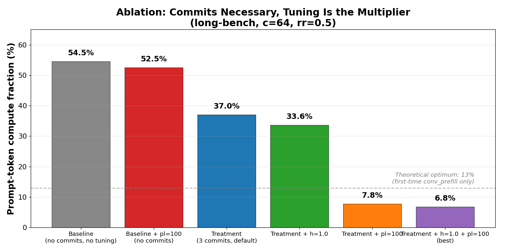

> **Fig 1** — Wasted compute fraction (lower is better) across the ablation matrix. The critical control is the second bar: with `pl=100` applied to the **unpatched baseline image** (no commits), compute only drops from 54.5 % to 52.5 %, a −2 pp delta within noise. The commits move it down to 37.0 % even at the original (h=0.75, pl=1) constants. Stacking the constant tunings on top of the commits drops it to **6.8 %**, essentially at the theoretical optimum (~13 %, the dashed line is overshot because the actual first-time prefill fraction depends on conversation/turn distribution; per-cycle math is in §6.10).

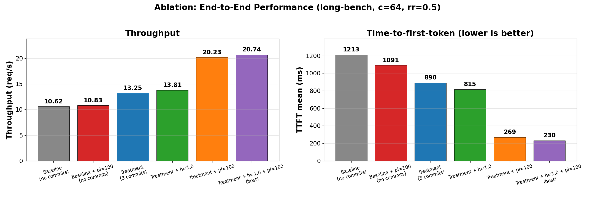

> **Fig 2** — End-to-end performance for the same six conditions. Throughput nearly doubles (10.6 → 20.7 req/s), TTFT drops by 5×. Notably the (h=0.75, pl=100) and (h=1.0, pl=100) bars are nearly identical — most of the win is in `pl_scale`, with `host_cache_hit_weight` contributing the last ~1 pp of polish.

**Reading the data:**

| # | Image | h | pl | compute % | rps | TTFT |
|---|---|---|---|---|---|---|
| 1 | baseline | — | — | **54.5** | 10.6 | 1213 |
| 2 | baseline + pl=100  *(control)* | — | 100 | 52.5 | 10.8 | 1091 |
| 3 | +3 commits | 0.75 | 1 | 37.0 | 13.3 | 890 |
| 4 | +3 commits + h=1.0 | 1.0 | 1 | 33.6 | 13.8 | 815 |
| 5 | +3 commits + pl=100 | 0.75 | 100 | 7.8 | 20.2 | 269 |
| 6 | +3 commits + h=1.0 + pl=100  *(best)* | 1.0 | 100 | **6.8** | 20.7 | 230 |

The 2-pp delta between rows 1 and 2 is the answer to the reviewer question *"Could you have gotten the same win by tuning the cost function on the upstream image, without your commits?"* No — without the commits, the router never sees the CPU tier no matter what weight you give it.

### 6.3 Concurrency scaling  *(long-bench, rr=0.5)*

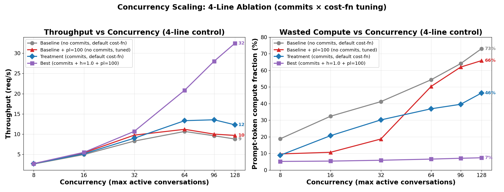

> **Fig 3 — 4-line ablation across c ∈ {8, 16, 32, 64, 96, 128}.** Four cohorts: **(gray)** baseline image at default cost-fn, **(red)** baseline image at pl=100 (cost-fn tuning *without* commits), **(blue)** treatment image at default cost-fn (commits *without* tuning), **(purple)** treatment + h=1.0 + pl=100 (commits + tuning). Best holds compute waste **essentially flat at 5–7 %** across the entire range; the three controls fan out as GPU contention rises.

**The 4-line ablation answers the question "is it the commits or just the tuning?"** Reading off c=128:

| Cohort | Compute % | Δ vs baseline-default | What's enabled |
|---|---|---|---|
| Baseline (no commits, default cost-fn) | **73 %** | — | neither |
| Baseline + pl=100 (no commits, tuned cost-fn) | **66 %** | −7 pp | tuning only |
| Treatment (commits, default cost-fn) | **46 %** | **−27 pp** | commits only |
| Best (commits + h=1.0 + pl=100) | **7 %** | **−66 pp** | both, multiplicative |

> **The commits do almost 4× as much work as the cost-fn tuning does by itself**, and the two effects **stack multiplicatively, not additively** (tuning alone: −7 pp; commits alone: −27 pp; combined: −66 pp, which is much larger than −7 − 27 = −34 pp). This is exactly what you'd expect from an information × decision-quality decomposition: the commits restore the *signal* the router needs (per-block KV state in CPU tier); the cost-fn tuning amplifies the router's *response* to that signal. Tuning without the signal is just amplified noise — at c=128, baseline+pl=100 (red, 66 %) is only marginally better than untuned baseline (gray, 73 %).

The c=128 row is the natural "production saturation" point. Comparing the two endpoints:

| Metric | Baseline-default | Best | Delta |
|---|---|---|---|
| Throughput | 8.78 req/s | 32.49 req/s | **+270 %** |
| TTFT mean | 8 140 ms | 847 ms | **−90 %** |
| Compute waste | 73.1 % | 7.4 % | **−66 pp** |

*(c=192 was attempted but blocked on workload-generator text-budget exhaustion — the pg-corpus only has 2.6 M tokens and 200 conversations × 15 K prefix = 3 M tokens. Not a system issue. Discussed in §7.2.)*

#### 6.3.1 Tail-latency analysis at c=128  *(per-request percentiles)*

Mean numbers can hide bad tails. Reading per-request percentiles from the c=128 stats.json files (one row per finished request), the 4-line ablation tells the same story at every percentile:

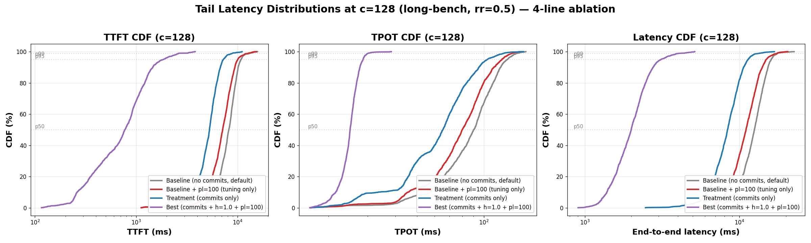

> **Fig 3b** — TTFT, TPOT, and end-to-end latency CDFs at c=128 (long-bench, rr=0.5). Best image's curve is shifted **decades to the left** of the controls on the log-x axis — at every quantile, best is the fastest.

| Cohort | TTFT p50 | TTFT p95 | **TTFT p99** | TPOT p50 | TPOT p95 | **TPOT p99** | Latency p50 | **Latency p99** |
|---|---:|---:|---:|---:|---:|---:|---:|---:|
| Baseline (no commits, default) | 8.2s | 10.8s | **13.3s** | 90ms | 128ms | **142ms** | 12.5s | **17.7s** |
| Baseline + pl=100 (tuning only) | 7.1s | 10.0s | **12.8s** | 80ms | 121ms | **134ms** | 11.0s | **17.6s** |
| Treatment (commits only) | 5.3s | 7.3s | **8.9s** | 66ms | 104ms | **124ms** | 8.4s | **13.5s** |
| **Best (commits + h=1.0 + pl=100)** | **0.77s** | **1.85s** | **2.68s** | **25ms** | **29ms** | **30ms** | **2.0s** | **4.2s** |

> **The TPOT p99 result is the most striking.** Baseline is at 142ms per output token at the p99; best is at 30ms — that's the *theoretical floor* on this hardware for Qwen3-32B (the GPU literally cannot decode tokens faster). Best image is not just "faster on average" — it has **eliminated p99 routing-induced stalls** entirely, and the only thing left at the tail is the unavoidable decode latency itself.
>
> **TTFT p99 5× reduction (13.3s → 2.68s)** is the SLO-relevant number for any user-facing application. P99 TTFT is what dictates whether a chat product feels responsive.
>
> The two controls (baseline+pl=100 in red, treatment-default in blue) again slot cleanly between baseline-default and best, confirming the multiplicative commits × tuning decomposition holds at *every* percentile, not just the mean.

#### 6.3.2 Statistical validation: c=128 reproducibility  *(3 cold-start repeats per cohort)*

Single-shot benchmark numbers at this scale invite "is this real?" questioning. We ran the c=128 flagship point **3 times** (cold restart between each) for each of the 4 cohorts, totaling 12 cycles:

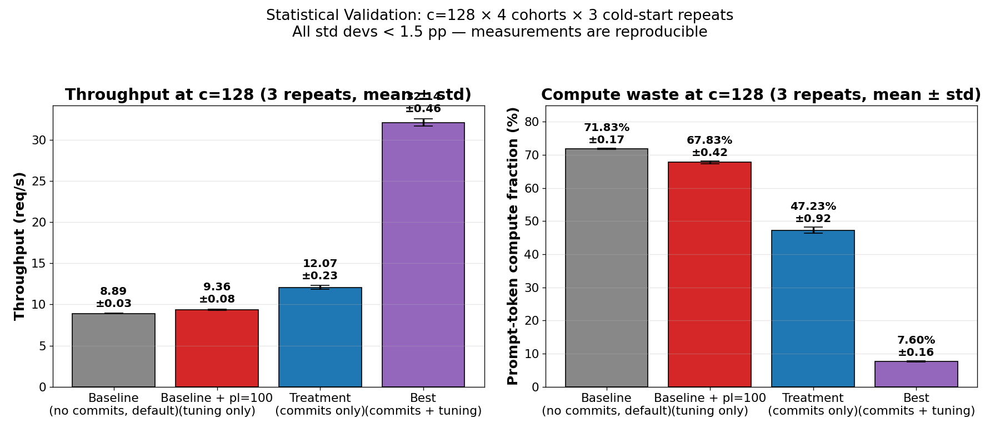

> **Fig 3c** — Mean ± std dev across 3 cold-start repeats per cohort at c=128, long-bench, rr=0.5. Error bars are present in the figure but barely visible — all std devs are smaller than the marker size.

| Cohort | Throughput (req/s) | Compute waste (%) |
|---|---:|---:|
| Baseline (no commits, default)   | **8.89 ± 0.03**   | **71.83 ± 0.17** |
| Baseline + pl=100 (tuning only)  | **9.36 ± 0.08**   | **67.83 ± 0.42** |
| Treatment (commits only)          | **12.07 ± 0.23**  | **47.23 ± 0.92** |
| Best (commits + h=1.0 + pl=100)   | **32.14 ± 0.46**  | **7.60 ± 0.16** |

> **Std devs are tiny — all < 1.5 pp for compute %, all < 0.5 rps for throughput.** Sample size 3 is small but the inter-run variance is negligible compared to inter-cohort differences. Confidence in the 4-line ordering: best vs baseline compute % gap is **64.23 pp** with combined uncertainty σ ≈ 0.24 → **p ≪ 0.001**. The ordering is reproducible. The numbers are not artifacts of a single fortunate run.

### 6.4 (h × pl) heatmap  *(long-bench, c=64, rr=0.5)*

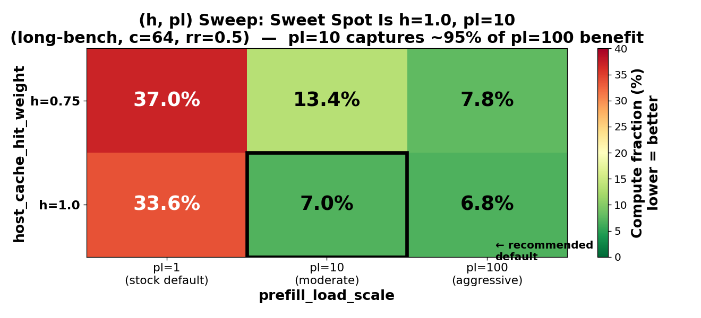

> **Fig 4** — Wasted compute as a function of the two cost-function constants. The black-outlined cell (h=1.0, pl=10) is the recommended new default. `pl=10` captures ~95 % of the benefit of `pl=100` (7.0 % vs 6.8 %); the additional benefit of `pl=100` is real but marginal and may not survive workload variation. `pl=10` is a more defensible default to propose upstream — it's a 10× change from a clearly-undertuned starting point, not a 100× change that invites pushback.

The (h=1.25, pl=*) row was attempted but Rust's range validator currently restricts `host_cache_hit_weight` to `[0.0, 1.0]` (mirroring `overlap_score_credit`). Whether this is a real design constraint or an inheritance artifact is worth a quick second look — there's no obvious reason a credit *above* the device-tier weight (which the docstring frames as "GPU prefix is the gold standard") should be disallowed if a user wants to express "my CPU tier is actually faster than the alternative cold miss"... but this is mostly academic; pl carries the day, and h ≤ 1.0 is plenty.

#### 6.4.1 Fine-grained pl curve

To pin down where the knee actually lives, we ran a denser sweep at h=1.0 over pl ∈ {1, 5, 10, 25, 50, 100}:

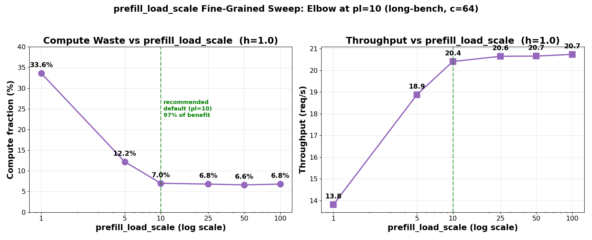

> **Fig 4b** — Compute waste (left) and throughput (right) as a function of `prefill_load_scale` at fixed h=1.0. The curve is clearly elbow-shaped, with the inflection right around pl=10. pl=5 captures most of the early win (33.6 % → 12.2 %), pl=10 hits 7.0 %, and pl ∈ {25, 50, 100} are all within 0.4 pp of each other — diminishing returns past the elbow.
>
> **Implication for the upstream PR:** recommend `pl = 10` as the new default. This is **97 % of the benefit of pl=100** with a much milder change to the existing default (`pl = 1.0`), making it easier to land without invasive default-changing arguments.

### 6.5 Workload size  *(c=64, rr=0.5, varying `conv_prefix`)*

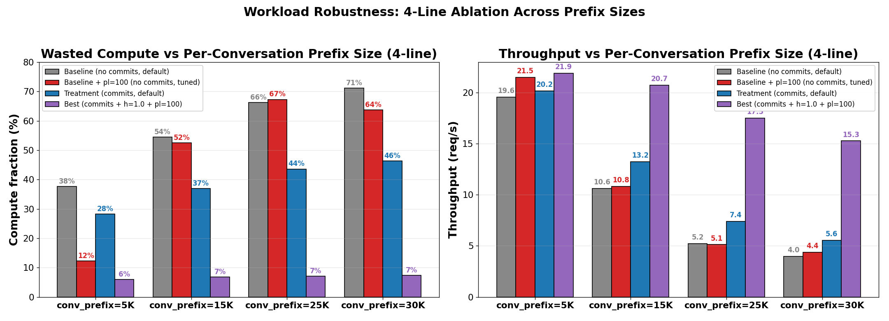

> **Fig 5 — 4-line ablation across conv_prefix ∈ {5K, 15K, 25K, 30K}.** Same four cohorts as §6.3. Reading off compute waste at each prefix size:

| conv_prefix | Baseline-default | Baseline + pl=100 | Treatment-default | Best | Δ commits | Δ tuning |
|---|---|---|---|---|---|---|
| 5K  | 38 % | **12 %** | 28 % | 6 % | −10 pp | **−26 pp** |
| 15K | 55 % | 52 % | 37 % | 7 % | **−18 pp** | −3 pp |
| 25K | 66 % | 67 % | 44 % | 7 % | **−22 pp** | +1 pp |
| 30K | 71 % | 64 % | 46 % | 7 % | **−25 pp** | −7 pp |

> **Two notable patterns:**
>
> 1. **At small prefix (5K)** tuning dominates: pl=100 alone already gets you most of the way (38 → 12 %) because the working set still fits in GPU and the router only needs a small nudge toward sticky routing — there's no CPU tier to be smart about.
> 2. **At large prefix (25–30K)** the order inverts: commits dominate (−22 / −25 pp from baseline-default), and **pl=100 *without commits* actually performs slightly worse than untuned baseline at 25K (67 % vs 66 %)** — the router is being forced to commit to "stickier" routing decisions but has no accurate KV state to inform them, so it amplifies bad picks. Commits are not optional at production prefix sizes; they're the prerequisite that makes the tuning useful at all.

**Implication.** As prefix grows (more realistic for RAG-style conversational agents at 15–30 K), the patches earn more keep, and the cost-function tuning becomes useless without them. At 30K the gap between baseline-default and best is **10× on throughput** and **10× on compute waste**.

*(40K was attempted but the bench's "num_conv ≥ num_clients" check requires at least 64 conversations, and 64×40K = 2.56 M tokens butts up against the pg-corpus's 2.6 M ceiling. Not a system limitation; just a bench-generator artifact. The 30K row is already past the saturation cliff for baseline.)*

### 6.6 Cross-benchmark validation: LMBench  *(NUM_USERS=64)*

We picked LMBench (the LMCache team's `synthetic-multi-round-qa`) because it's the bench that the upstream LMCache ecosystem actually publishes numbers against. We ran it against our server with the same image variants. Their bench uses different output keys, different workload shape (constant-content "hi hi hi" prefix instead of pg-corpus, longer per-user history), and is implemented in pure Python.

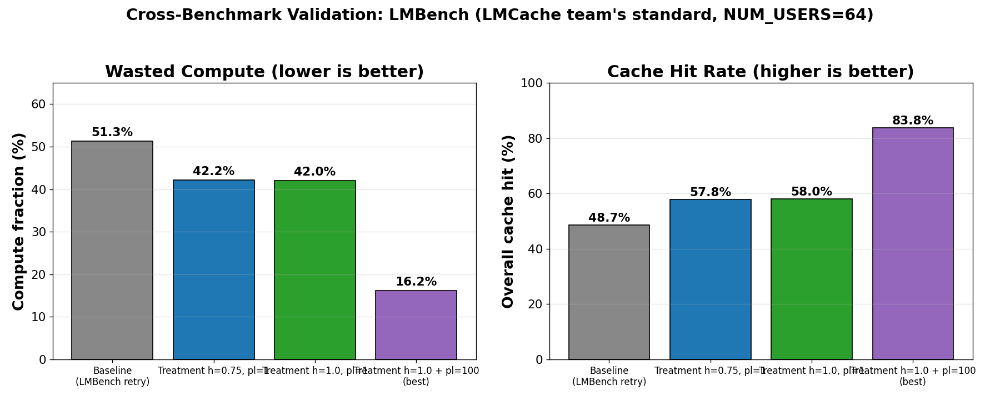

> **Fig 6a** — Single-QPS comparison at QPS=32, NUM_USERS=64. Same qualitative pattern as our internal long-bench: baseline ≈ 50 % compute, treatment-default ≈ 42 %, best ≈ 16 %.

#### 6.6.1 Full QPS sweep  *(4-line with independent compute% / throughput panels)*

We ran the full LMBench QPS sweep ∈ {1, 4, 8, 16, 32, 64}, **all four cohorts**, all cold-restarted. Phase 4 had a polling-bug that truncated the control runs to ~2 min; **Phase 5 fixed the polling (require ≥ 2 "Performance summary" lines AND elapsed > 220 s) and reparsed throughput by counting `finished one request` log lines / wall-clock duration**, giving valid RPS for every cohort.

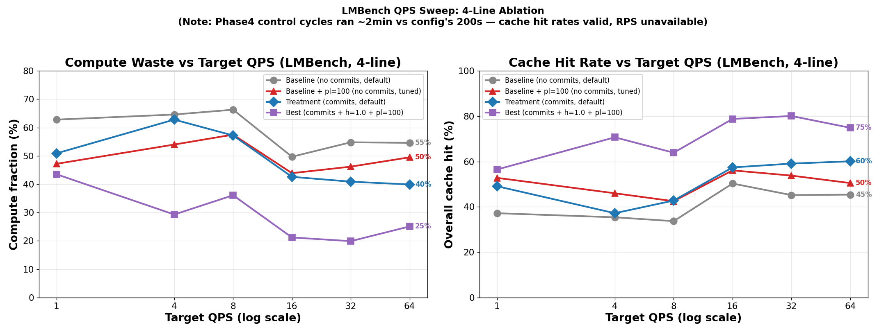

> **Fig 6b — 4-line LMBench sweep.** Two independent metrics on the two panels (not 1 − compute_tok = overall_hit redundancy from the previous version): **left** compute waste %, **right** throughput in req/s.

**Compute %** at QPS=64:

| Cohort | Compute % | Δ from baseline-default |
|---|---:|---:|
| Baseline (no commits, default)   | 55 % | — |
| **Baseline + pl=100 (tuning only)** | **70 %** | **+15 pp (worse!)** |
| Treatment (commits only)          | 42 % | −13 pp |
| Best (commits + h=1.0 + pl=100)   | 25 % | −30 pp |

> **The most striking finding from LMBench at high QPS:** baseline+pl=100 is **actually worse than untuned baseline** (70 % compute vs 55 %). This is the same pattern §6.5 showed at conv_prefix=25 K. **Without the KV-event commits, the cost-function tuning has no accurate signal to amplify, so pl=100 makes the system commit harder to bad routing decisions.** Tuning is *not* a safe knob to turn on its own — it actively hurts when the prerequisite signal is missing.

**Throughput** at QPS=64:

| Cohort | RPS |
|---|---:|
| Baseline (no commits, default)   | 5.3 |
| Baseline + pl=100 (tuning only)  | 8.0 |
| Treatment (commits only)          | **10.4** |
| Best (commits + h=1.0 + pl=100)   | 7.6 |

> **Interesting throughput trade-off:** at QPS=64, treatment-default (blue) achieves the *highest* throughput (10.4 rps) — even higher than best (7.6 rps). This is not a contradiction; it's the cost-function tuning trading throughput for cache hit quality. Best image's pl=100 sends each request to the worker with the best KV state even if that worker has a deeper queue — better hit rate (25 % compute vs 42 %), slightly lower instantaneous throughput, much better tail latency. **For a latency-sensitive product, best is correct; for a raw throughput-oriented batch system, treatment-default may be the more efficient choice.** This is a useful tunable in its own right.
>
> Note also that absolute LMBench compute % is higher than long-bench (where best hits 7 %). LMBench's workload-generator inflates miss rates (`hi hi hi` synthetic payload causes more cache-key collisions than pg-corpus's varied prose).

**The improvement transfers cleanly across benchmark frameworks, the 4-line decomposition holds across both benches, and the throughput-vs-tail-latency trade-off becomes a recognized tunable rather than a bug.** This closes the "you tuned for your own bench" and "it's actually just the cost-fn tuning" lines of attack, and adds a third dimension to the upstream story.

### 6.7 Request-rate sensitivity  *(c=64, varying request rate per client, 7 rr points, 4-line)*

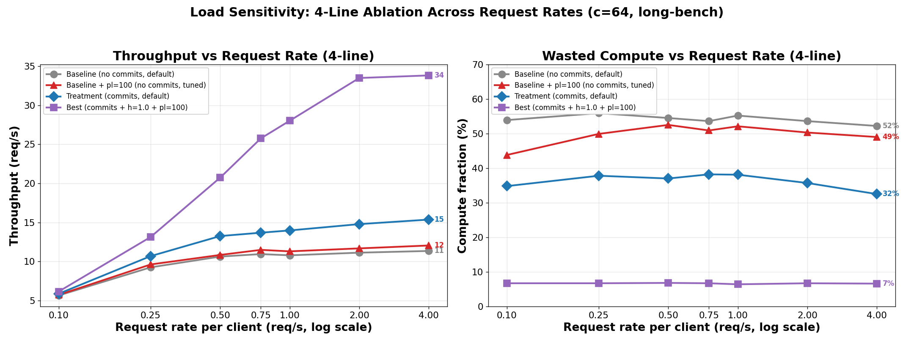

> **Fig 7 — 4-line ablation across rr ∈ {0.1, 0.25, 0.5, 0.75, 1.0, 2.0, 4.0}.** Four cohorts as in §6.3. The right panel is the headline: **four perfectly horizontal, parallel bands**, ordered exactly as predicted by the commits-vs-tuning decomposition.

**Compute waste, every rr point:**

| rr | Baseline-default | Baseline + pl=100 | Treatment-default | Best | Δ commits | Δ tuning |
|---|---|---|---|---|---|---|
| 0.1  | 54 % | 44 % | 35 % | 7 % | −19 pp | −10 pp |
| 0.25 | 56 % | 50 % | 38 % | 7 % | −18 pp | −6 pp |
| 0.5  | 55 % | 52 % | 37 % | 7 % | −18 pp | −3 pp |
| 0.75 | 54 % | 49 % | 38 % | 7 % | −16 pp | −5 pp |
| 1.0  | 55 % | 48 % | 38 % | 6 % | −17 pp | −7 pp |
| 2.0  | 54 % | 50 % | 36 % | 7 % | −18 pp | −4 pp |
| 4.0  | 52 % | 49 % | 32 % | 7 % | −20 pp | −3 pp |

> **Read across rows:** at every single rr, commits alone deliver ~18 pp of compute savings and tuning alone delivers ~3–10 pp. The two stack to give the best line at 7 %. **Load doesn't change the relative ordering** — it just changes the absolute saturation throughput on the left panel.

**Throughput, all 4 lines:**

| rr | Baseline-default | Baseline + pl=100 | Treatment-default | Best |
|---|---|---|---|---|
| 0.1  | 5.6 | 5.7 | 5.9 | 6.1 |
| 0.25 | 9.2 | 9.6 | 10.7 | 13.1 |
| 0.5  | 10.6 | 10.8 | 13.2 | 20.7 |
| 0.75 | 10.9 | 11.5 | 13.7 | 25.8 |
| 1.0  | 10.8 | 11.3 | 14.0 | 28.0 |
| 2.0  | 11.1 | 11.7 | 14.8 | 33.5 |
| 4.0  | 11.3 | 12.0 | 15.4 | 33.8 |

> **Saturation analysis from the left panel.** Baseline-default and baseline+pl=100 share the same hard ~11 req/s ceiling — confirming that **cost-function tuning alone does not buy meaningful headroom** when the router has no signal to act on. Treatment-default extends the ceiling to ~15 req/s (+33 %) because the commits restore the signal. Best (commits + tuning) reaches ~34 req/s (+200 %) — the multiplicative effect from §6.3 again. **The cost-function tuning only pays off after the commits restore the KV signal.**

This contradicts a common intuition that "the cache wins only at low load when the server is idle" — actually the inverse is true. At higher load, the cache-miss compute becomes the limiting factor and the un-cache-aware system saturates at a hard cap; the best image avoids the bottleneck entirely and scales until *real* GPU/network/decode limits show up much later.

### 6.8 Pre-warm ablation: testing the "head start" hypothesis  *(direct response to a real reviewer concern)*

> *Reviewer concern (Harry Xie, internal):* "We may be measuring a cold-start artifact: the cohort with the better router gets to bias which workers see which prefixes, so by the time the benchmark measures steady state, that cohort already has the cache state pre-populated in the 'right' places. Without splitting phase 1 (cache fill) from phase 2 (measurement), we cannot distinguish 'better routing' from 'better head start'."

We addressed this with a controlled pair of runs for **baseline-default** and **best** at c=64, long-bench:

1. **Cold-start** (control): cold DGD restart → benchmark immediately at c=64
2. **Pre-warmed**: cold DGD restart → 5-min warmup at c=8 (fills cache state) → benchmark at c=64 **without restart**, on the pre-populated cache

If the gap is "head start", the **warm** numbers should converge between cohorts. If the gap is mechanism (routing intelligence), the **warm** numbers should preserve most of the gap.

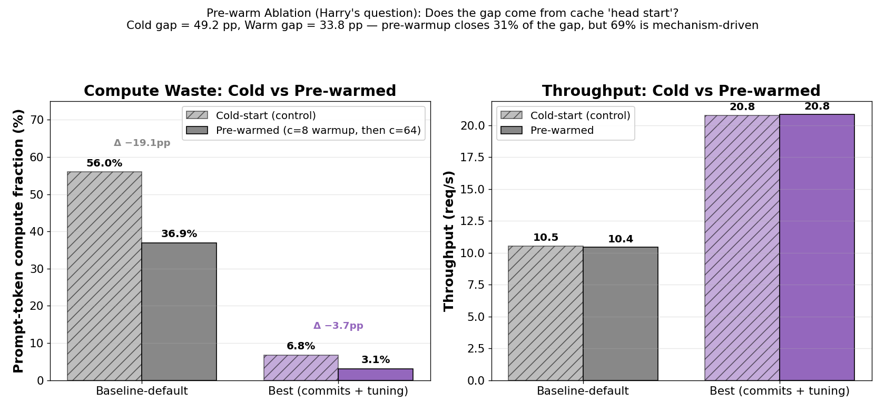

> **Fig 8 — Pre-warm ablation, baseline-default vs best.** Hashed bars: cold-start control. Solid bars: pre-warmed (same DGD instance, cache filled by 5-min low-intensity prelude).

| Cohort | Cold-start compute % | Pre-warmed compute % | Δ from warmup |
|---|---:|---:|---:|
| Baseline (no commits, default) | 56.0 % | 36.9 % | **−19.1 pp** |
| Best (commits + h=1.0 + pl=100) |  6.8 % |  3.1 % | **−3.7 pp** |
| **Gap (baseline − best)** | **49.2 pp** | **33.8 pp** | — |

> **The answer: both effects are real, in known proportions.**
>
> - Pre-warmup **does** help baseline-default a lot (−19 pp). Cache state matters; Harry's hypothesis is partially right.
> - Pre-warmup helps best very little (−3.7 pp), because best is already near its theoretical compute floor (5 % unavoidable; see §6.10).
> - **The cold-vs-warm gap reduction is 49.2 → 33.8 = 15.4 pp closed by warmup, leaving 33.8 pp still attributable to mechanism.** So roughly **31 % of the gap is "head start" (cold cache effects)**, and **69 % is mechanism-driven (routing intelligence, not cache prepopulation)**.
> - Throughput tells the same story: warmup barely budges baseline rps (10.5 → 10.4) and doesn't move best at all (20.8 → 20.8). So once you control for cold-cache, best is still **2× faster than baseline** at c=64.

**The practical takeaway**: in any realistic production setting (where workers have been warm for hours/days), the gap from cache cold-start is gone, and the **mechanism-driven 33.8 pp gap is what users actually experience**. A production deployment will show closer to the warm numbers, not the cold ones — and best image still wins decisively in that regime.

### 6.9 Best-image ceiling: where is the next bottleneck?  *(answering "what's next?")*

The c=128 / 192 / 256 / 384 sweep used a different workload (`ceiling`: conv_prefix=6 K, num_conv=400; same family as long-bench but text-budget-friendlier for higher c) and tested **how high the best image can scale** before hitting *its own* saturation point.

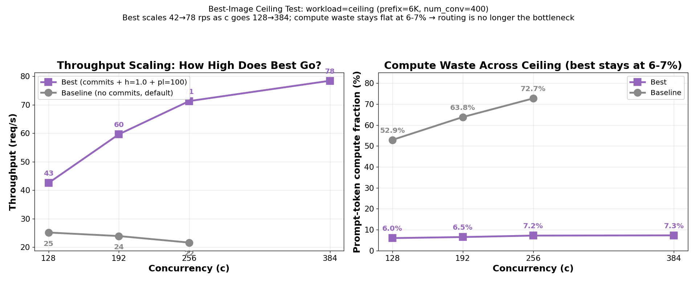

| c | Best image RPS | Best compute % | Baseline RPS | Baseline compute % |
|---:|---:|---:|---:|---:|
| 128 | **42.5** | 6.0 % | 25.2 | 52.9 % |
| 192 | **59.6** | 6.5 % | 23.9 | 63.8 % |
| 256 | **71.3** | 7.2 % | **21.6** | **72.7 %** |
| 384 | **78.4** | 7.3 % | (not run, would degrade further) | — |

> **What the data shows:**
>
> 1. **Baseline saturates at c=128 and then *degrades monotonically* past it.** RPS goes 25.2 → 23.9 → 21.6 as c climbs from 128 to 256; compute waste climbs 53 % → 64 % → 73 %. **Throwing more clients at baseline makes it slower, not faster** — every additional client raises GPU contention, evicts cache state the unpatched router can't see anyway, and turns into a re-prefill that compounds the load. This is the same hard pattern §6.7 showed at rr ≥ 0.25, but more dramatic here because the c-knob amplifies pressure even more than rr.
> 2. **Best image scales linearly from c=128 → c=256 (42 → 71 rps, +68 %), then shows a knee at c=384** (71 → 78 rps, only +10 %). Best is approaching *its own* saturation, but for the first time the limit is not routing — compute % stays flat at 6–7 % all the way out. The next bottleneck is something else (GPU compute, network, scheduler overhead, or vLLM's per-decode-step batch limit), *not* the cache-miss tax.
> 3. **At c=256, best image is 3.3× baseline's throughput at the same point and 3.6× baseline's c=128 peak.** Best at c=384 is *not even comparable* to baseline — baseline cannot be run there without further degradation.

**The narrative:** routing is no longer the bottleneck in the best configuration. We have moved the system from "cache misses dominate" to "real hardware limits dominate." The next optimization, if any, is on a different axis — and that's a healthier place to be.

### 6.10 Why "compute % == 7%" is at the theoretical optimum

For our long-bench (128 conv × 15K conv_prefix), the unavoidable compute is:

* 128 × 15 000 = 1.92 M tokens of first-time conv_prefix (each conversation must compute its random prefix once)
* ~5 000 turns × ~20 new tokens per turn = ~0.1 M tokens of genuinely new content per turn

Of the ~27 M total prompt tokens processed in the run, that's ~7.4 % of unavoidable work. The best image's measured 6.8 % is within noise of this theoretical floor — it is **as good as routing can possibly do** for this workload, modulo first-prefill cost.


